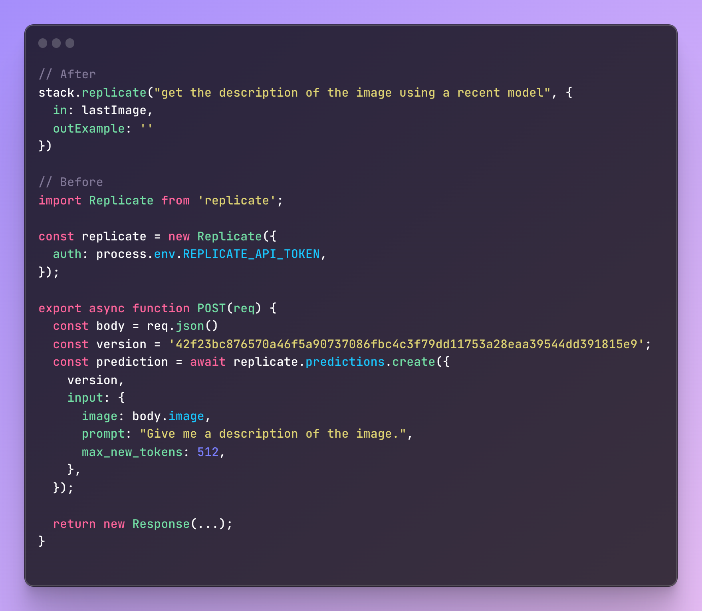

# Stackwise: Explain what you want a function to do, and AI builds it..

[](https://discord.gg/KfUxa8h3s6)
[](https://twitter.com/stackwiseai)
[](https://github.com/stackwiseai/stackwise/stargazers)
[](https://opensource.org/licenses/MIT)

Stackwise is a VSCode extension that increases development productivity without switching focus. Based on a description of functionality, it generates and imports the code that you need.


# demo here

### Usage

Stackwise introduces a straightforward command structure, where you specify a 'brief' for the desired action, along with the inputs and outputs:

```typescript
stack("brief describing a specific action", {
    in: /* single input or object {} with multiple inputs */,
    out: // same as above, but output
})
```

The input and output are optional, meaning you will get a fully typed function even if you just use:

```typescript
stack('brief');
```

This approach streamlines API interactions, reducing the need for intricate coding and extensive API knowledge. Fully typed, and editable within your repo.

Upon saving your command, Stackwise replaces it with a collapsed function with your inputs and an import statement at the top of your file. The generated code resides in the /stacks directory within your project root, ensuring clean and maintainable codebase.

### Special Note for NextJS Developers

NextJS developers can leverage Stackwise for server actions, making API integrations even smoother. Here’s an example demonstrating the use of Stackwise in a NextJS environment:



### Current Integrations

Stackwise currently integrates with three APIs:

- Replicate
- OpenAI
- Pinecone

Contributions to improve these or add new integrations are welcome. If you're interested in expanding Stackwise's capabilities, feel free to submit a pull request or contact us (join the Discord or contact@stackwise.ai) for collaboration.

### Getting Started
Prerequisites:
- Typescript project
- openai api key
- pinecone api key

To start using Stackwise, follow these steps:

1. Clone the Stackwise repository:

```bash
git clone https://github.com/stackwiseai/stackwise.git
```
2. cd stackwise
3. npm install
4. copy the launch.json.example into launch.json and fill these environment variables:
- PINECONE_API_KEY
- PINECONE_ENVIRONMENT=PINECONE_ENVIRONMENT
- OPENAI_API_KEY=OPENAI_API_KEY
5. Click Run and Debug -> Click on the play button "Run Extension"
6. Open your typescript project. In your typescript project, type:
```typescript
const prompt = "What's the capital of the United States ?"
result = await stack(
    "Ask a question to GPT-4",
    {
        in: prompt
        output: "Washington D.C"
    }
)
```
7. Save your file. The function should collapse into something like this.
const prompt = "What's the capital of the United States ?"
```typescript
const result = await askGPT4(prompt)
```
8. You can cmd + click (ctrl + click on windows) on the function to see the code of the function.
9. If you don't like the code, edit it.

### Roadmap

Our future developments include:

- [ ] Interactive stack modification: Chat with your stack to refine and improve it.

- [ ] Dynamic input chains: Link multiple stacks to each other using dynamic inputs. Currently only static briefs work.

- [ ] Expand integrations: Continually adding more APIs based on community feedback. Let us know what you want to see next!

- [ ] API insights: See what APIs you're calling most and how what you're using them for.

- [ ] Non-collapsible stacks: Edit your stacks continuously without automatic collapsing. If something with the api changes, it will automatically heal to work.

### Join The Community

[](https://discord.gg/KfUxa8h3s6)

We welcome contributions, feedback, and suggestions to further enhance Stackwise.

We want to make API integration easy, without the hassle of reading documentation or ever leaving your IDE. If you made it here you're at the very least intruiged and we'd love to have you :)

---

This project is licensed under the [MIT License](LICENSE).
