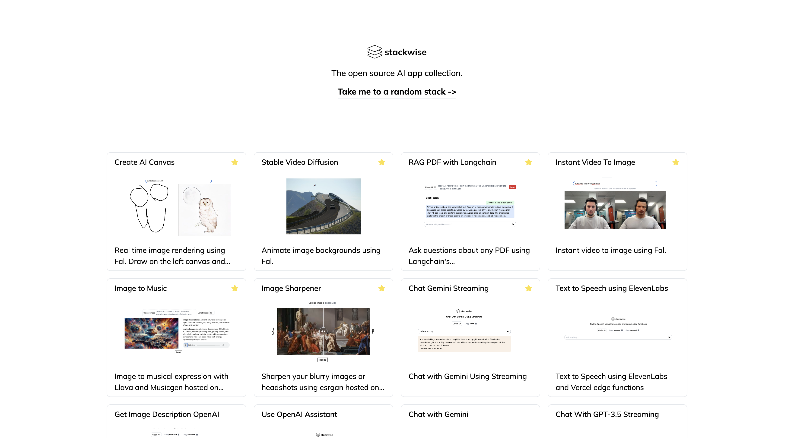

# Stackwise: Explain what you want a function to do, and AI builds it.

### [Visit the Stackwise collection](https://stackwise.ai/stacks)

### Roadmap

Our future developments include:

- [ ] Interactive stack modification: Chat with your stack to refine and improve it.

- [ ] Host a stack as an sdk

- [ ] Expand integrations: Continually adding more stacks based on community feedback and contributors. Let us know what you want to see next!

### Join The Community

We welcome contributions, feedback, and suggestions to further enhance Stackwise. If you made it here you're at the very least intruiged and we'd love to have you :)

---

This project is licensed under the [MIT License](LICENSE).
